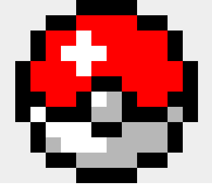
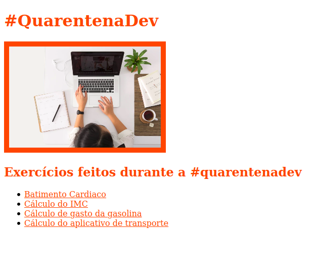

# Aula 05: HTML e CSS

> [:link: Site](https://www.alura.com.br/quarentenadev/aula05-html-css "Site da aula 05")

Seja bem vindo e bem vinda à quinta aula da **#QuarentenaDev**!
A espera acabou, vamos aprender como os programadores e programadoras apresentam e estilizam as informações que vemos nos sites todos os dia.

Use o codepen, marque a [@aluraonline](https://github.com/alura-cursos "GitHub da alura") no [instagram](https://www.instagram.com/aluraonline "Instagram da alura"), [twitter](https://www.twitter.com/aluraonline "Twitter da alura") e muito mais!

## Aula

> [:link: Videoaula](https://www.youtube.com/watch?v=dk-OawbD0HU "Vídeo não listado no YouTube")

## Desafio da Vanessa

Estudar os capitulos introdutórios da documentação:

- [:link: JS ](https://developer.mozilla.org/pt-BR/docs/Web/JavaScript "Documentação JavaScript")

- [:link: HTML ](https://developer.mozilla.org/pt-BR/docs/Web/HTML "Documentação HTML")

- [:link: CSS ](https://developer.mozilla.org/pt-BR/docs/Web/CSS "Documentação CSS")

## Desafio do Artur

Ao invés de deixar apenas o fundo branco com a letras pretas, usar o `document.write` junto com CSS para estilizar a calculadora da aula passada da maneira que você quiser!!

> [:dart: Resolução](https://codepen.io/newtmagalhaes/pen/oNXRyRd "Código no codepen")

## Desafio do Mário

Será que você consegue mudar a cor da pokebola de vermelho para roxo???

> [:dart: Resolução](./pokebox.html "Código no HTML")

Cada tag é uma caixa.
`<div> </div>` é a nossa caixa e podemos aplicar efeitos nela.
Um deles é o efeito de sombra com a propriedade [:link: _box-shadow_](https://developer.mozilla.org/pt-BR/docs/Web/CSS/box-shadow "Documentação sobre box-shadow") do CSS.

```CSS
div {
box-shadow: tamanho tamanho tamanho tamanho cor;
}
div {  
box-shadow: 0px 0px 0px 0px green;
}
```

Essa propriedade permite que várias sombras possam ser declaradas para a mesma tag.
Não é por ser sombra que ela tem que ser esfumaçada e transparente, podemos fazer sombras nítidas e sólidas!

> [:dart: Resolução](https://codepen.io/newtmagalhaes/pen/QWjwweG "Código no codepen")



## Desafio master

Se você conseguiu trocar a cor da pokebola, será que você consegue criar a sua?

> [:dart: Resolução](./pokecircle.html "Código no HTML")

> [:dart: Resolução](https://codepen.io/newtmagalhaes/pen/GRpgBqm "Código no codepen")

## Mais um exercício

Aprendemos algumas _tags_ HTML e como estilizar essas _tags_ usando CSS.
Será que você é capaz de reproduzir o seguinte _layout_?

> [:dart: Resolução](./layout.html "Código no HTML")

> [:dart: Resolução](https://codepen.io/newtmagalhaes/pen/mdeyjBM "Código no codepen")



### Dicas

- Temos _links_ no HTML, quando eu clicar nele vou ir direto para o codepen onde você criou o exercicio;

- Os _links_ estão dentro de uma lista para ficar organizados;

- Essa borda mais grossa fazemos pelo CSS;

- Lembrando que a imagem, a largura e altura da imagem e espessura da borda não precisam ser exatamente iguais!

Por último, aqui está o [:link: material sobre vscode](https://github.com/alura-cursos/projeto-codepen-local-quarentenadev "Repositório da #QuarentenaDev") que o mário mostrou no video.

## Participantes

- [Paulo Silveira](https://twitter.com/paulo_caelum "Perfil no Twitter")

- [Mario Souto](https://twitter.com/omariosouto "Perfil no Twitter")

- [Vanessa Tonini](https://twitter.com/vanessametonini "Perfil no Twitter")

- [Artur Diniz](https://twitter.com/artdiniz "Perfil no Twitter")

- [Amanda Almeida](https://www.instagram.com/theamandaalmeida "Perfil no Twitter")
