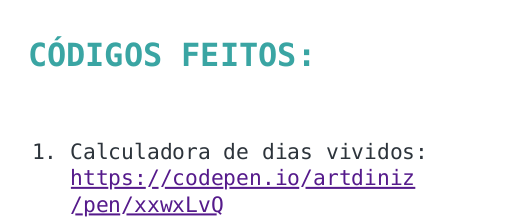

# Aula 10: Completando nosso certificado

> [:link: Site](https://www.alura.com.br/quarentenadev/aula10-completando-o-certificado-e-curriculo "Site da aula 10")

Seja bem-vindo e bem-vinda à última da **#QuarentenaDev**!
É certificado que vocês querem??
Então nessa última aula vamos criar o nosso!
Aliás, você vai criar o seu e modificá-lo, além de conter todo seu portfolio.
Não deixe de compartilhá-lo e marcar a gente.

São os últimos momentos da nossa quarentena!
As aulas ficarão no ar por mais uma semana, assim como a nossa comunidade.

Quer ir um pouco além?
Alguns canais e playlists para você dar os próximos passos:

## Playlist com dicas de CSS para melhorar seu projeto

[:link: Playlist](https://www.youtube.com/playlist?list=PLh2Y_pKOa4UfHbRqfiiI4uWik2MOKHRfL "Playlist no youtube")

## Playlist respondendo dúvidas de iniciantes

[:link: Playlist](https://www.youtube.com/playlist?list=PLh2Y_pKOa4UcBRWcWAEp4d4M7INLCec1f "Playlist no youtube")

## Canal do Mário onde ele ensina muito código JavaScript

[:link: Playlist](https://www.youtube.com/playlist?list=PLh2Y_pKOa4UfsZfAT5ylSsbcEjpguxoBI "Playlist no youtube")

## Aula

> [:link: Videoaula](https://www.youtube.com/watch?v=5yTQRs8vrlI "Vídeo não listado no youtube")

[:link: codepen](https://codepen.io/artdiniz/pen/oNjvYJY "Codepen do Art") base para acompanhar a aula!!

[:link: codepen](https://codepen.io/newtmagalhaes/pen/wvKaKYX?editors=0011 "Codepen do Anilton") com JavaScript feito por mim!!

## Desafio aula 10

Será que usando JavaScript você consegue imprimir ou seja abrir a janela de impressão de documento e salvar seu certificado que fizemos no codepen em pdf ou até imprimir mesmo?
Dica é um comando apenas

Nós vimos como colocar links para nossas atividades

```HTML
<li><a href="link do codepen">Nome da atividade da aula</a></li>
```

Se você conseguiu imprimir seu certificado, percebeu que os links não aparecem.
Será que você consegue deixar eles aparecendo igual na imagem:



## Como imprimir o certificado

Caso você queira imprimir o seu certificado, basta colocar a função `print()` ao final do código se baseando no exemplo do que a Amanda fez, mas não está no vídeo: [:link: Exemplo](https://codepen.io/theamandaalmeida/pen/gOaYLqo "Codepen da Amanda").

## Links Extras

[:link: Apostila de Desenvolvimento Web](https://www.caelum.com.br/apostila-html-css-javascript/ "Apostila da Caelum") da [:link: Caelum](https://www.caelum.com.br/ "Site da Caelum") com muito HTML, CSS e JavaScript.

[:link: Documentação](https://developer.mozilla.org/pt-BR/docs/Aprender/Getting_started_with_the_web/CSS_basico "Documentação do CSS") da MDN explicando mais sobre CSS.

## Participantes

- [Paulo Silveira](https://twitter.com/paulo_caelum "Perfil no Twitter")

- [Mario Souto](https://twitter.com/omariosouto "Perfil no Twitter")

- [Vanessa Tonini](https://twitter.com/vanessametonini "Perfil no Twitter")

- [Artur Diniz](https://twitter.com/artdiniz "Perfil no Twitter")

- [Amanda Almeida](https://www.instagram.com/theamandaalmeida "Perfil no Twitter")
